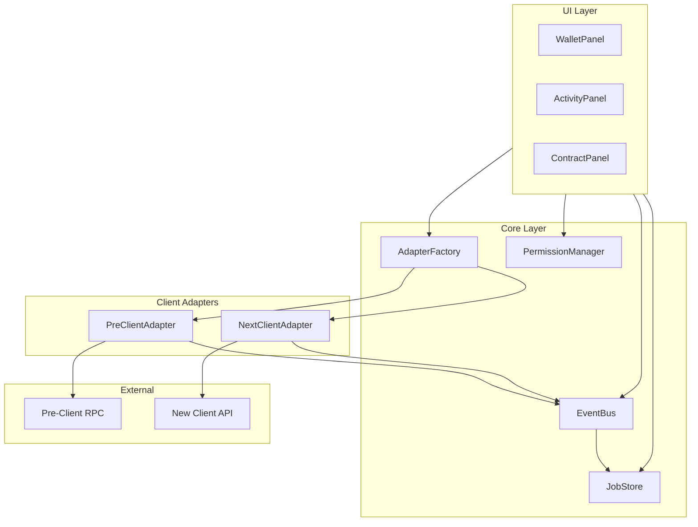
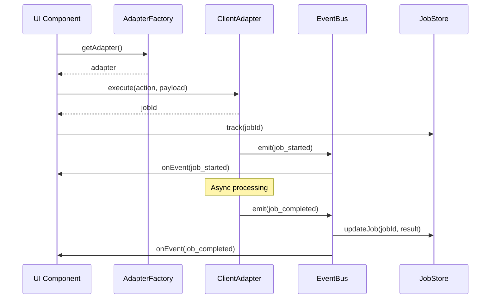

# Design Document: Octra Client Migration

## Overview

This design document outlines the architecture and implementation approach for migrating OctWa to be compatible with the upcoming Octra new client release. The migration introduces a client-agnostic architecture that decouples the UI and SDK from specific client implementations, enabling seamless switching between the legacy pre-client and the new client.

The key architectural changes include:
- A client adapter abstraction layer
- Async job-based transaction model
- Internal event bus for client events
- Encrypted value handling with explicit decryption
- Capability-based wallet permission model
- Separated UI panels for wallet, activity, and app interactions

## Architecture

### High-Level Architecture



### Component Interaction Flow



## Components and Interfaces

### 1. Client Adapter Interface

The core abstraction that decouples UI from client implementations.

```typescript
// src/adapters/types.ts

export type JobId = string;

export type JobStatus = 'pending' | 'completed' | 'failed';

export interface Job {
  id: JobId;
  action: string;
  status: JobStatus;
  payload: unknown;
  result?: unknown;
  error?: string;
  createdAt: number;
  updatedAt: number;
}

export type ClientEventType = 
  | 'job_started'
  | 'job_completed'
  | 'job_failed'
  | 'encrypted_result_ready'
  | 'connection_changed';

export interface ClientEvent {
  type: ClientEventType;
  jobId?: JobId;
  data?: unknown;
  error?: string;
  timestamp: number;
}

export interface OctraClientAdapter {
  /** Connect to the client */
  connect(): Promise<void>;
  
  /** Execute an action and return a job ID for tracking */
  execute(action: string, payload: unknown): Promise<JobId>;
  
  /** Subscribe to client events */
  onEvent(handler: (event: ClientEvent) => void): () => void;
  
  /** Disconnect from the client */
  disconnect(): Promise<void>;
  
  /** Check if connected */
  isConnected(): boolean;
}
```

### 2. Adapter Factory

Factory for creating and managing client adapters.

```typescript
// src/adapters/factory.ts

export type ClientType = 'pre-client' | 'next-client';

export interface AdapterFactoryConfig {
  clientType: ClientType;
  rpcUrl?: string;
}

export interface AdapterFactory {
  /** Get the current adapter instance */
  getAdapter(): OctraClientAdapter;
  
  /** Switch to a different client type */
  switchClient(type: ClientType): void;
  
  /** Get current client type */
  getClientType(): ClientType;
}
```

### 3. Event Bus

Global event handling mechanism for client events.

```typescript
// src/events/eventBus.ts

export type EventHandler<T = unknown> = (event: T) => void;

export interface EventBus {
  /** Subscribe to an event type */
  on<T>(eventType: string, handler: EventHandler<T>): () => void;
  
  /** Emit an event */
  emit<T>(eventType: string, event: T): void;
  
  /** Remove all handlers for an event type */
  off(eventType: string): void;
  
  /** Remove all handlers */
  clear(): void;
}
```

### 4. Job Store

Store for tracking async job states.

```typescript
// src/stores/jobStore.ts

export interface JobStore {
  /** Track a new job */
  track(jobId: JobId, action: string, payload: unknown): void;
  
  /** Get job by ID */
  get(jobId: JobId): Job | undefined;
  
  /** Get all jobs */
  getAll(): Job[];
  
  /** Get jobs by status */
  getByStatus(status: JobStatus): Job[];
  
  /** Update job status */
  updateStatus(jobId: JobId, status: JobStatus, result?: unknown, error?: string): void;
  
  /** Subscribe to job changes */
  subscribe(handler: (jobs: Job[]) => void): () => void;
  
  /** Clear completed/failed jobs */
  clearFinished(): void;
}
```

### 5. Encrypted Value Type

Type for handling opaque encrypted data.

```typescript
// src/types/encrypted.ts

export interface EncryptedValue {
  /** The encrypted data blob */
  blob: Uint8Array;
  
  /** Optional hint about the underlying type */
  typeHint?: 'balance' | 'message' | 'contract_result' | 'unknown';
  
  /** Whether this value has been decrypted */
  isDecrypted: boolean;
  
  /** The decrypted value (only set after explicit decryption) */
  decryptedValue?: unknown;
}

export interface DecryptionRequest {
  /** The encrypted value to decrypt */
  value: EncryptedValue;
  
  /** User consent confirmation */
  userConsent: boolean;
}

export interface DecryptionResult {
  success: boolean;
  value?: unknown;
  error?: string;
}
```

### 6. Capability Permission Model

Permission system for dApp capabilities.

```typescript
// src/permissions/types.ts

export type WalletCapability = 
  | 'tx_sign'
  | 'runtime_execute'
  | 'decrypt_result'
  | 'reencrypt_for_third_party'
  | 'view_address'
  | 'view_balance';

export interface CapabilityRequest {
  /** Origin of the requesting dApp */
  origin: string;
  
  /** Name of the dApp */
  appName: string;
  
  /** Requested capabilities */
  capabilities: WalletCapability[];
  
  /** Timestamp of request */
  timestamp: number;
}

export interface GrantedCapabilities {
  /** Origin of the dApp */
  origin: string;
  
  /** Granted capabilities */
  capabilities: WalletCapability[];
  
  /** When capabilities were granted */
  grantedAt: number;
  
  /** Optional expiration */
  expiresAt?: number;
}

export interface PermissionManager {
  /** Request capabilities from user */
  requestCapabilities(request: CapabilityRequest): Promise<GrantedCapabilities | null>;
  
  /** Check if dApp has a capability */
  hasCapability(origin: string, capability: WalletCapability): boolean;
  
  /** Get all granted capabilities for a dApp */
  getCapabilities(origin: string): WalletCapability[];
  
  /** Revoke capabilities for a dApp */
  revokeCapabilities(origin: string, capabilities?: WalletCapability[]): void;
  
  /** Get all connected dApps with their capabilities */
  getAllGrantedCapabilities(): GrantedCapabilities[];
}
```

## Data Models

### Job Model

```typescript
interface Job {
  id: string;              // Unique job identifier
  action: string;          // Action type (e.g., 'send_tx', 'call_contract')
  status: JobStatus;       // 'pending' | 'completed' | 'failed'
  payload: unknown;        // Original request payload
  result?: unknown;        // Result data (may be encrypted)
  error?: string;          // Error message if failed
  createdAt: number;       // Unix timestamp
  updatedAt: number;       // Unix timestamp
}
```

### Encrypted Balance Model

```typescript
interface EncryptedBalanceData {
  public: EncryptedValue | number;    // Public balance (may be encrypted)
  encrypted: EncryptedValue | number; // Encrypted balance
  total: EncryptedValue | number;     // Total balance
}
```

### Permission Grant Model

```typescript
interface PermissionGrant {
  origin: string;
  appName: string;
  appIcon?: string;
  capabilities: WalletCapability[];
  grantedAt: number;
  lastUsed?: number;
}
```


## Correctness Properties

*A property is a characteristic or behavior that should hold true across all valid executions of a system-essentially, a formal statement about what the system should do. Properties serve as the bridge between human-readable specifications and machine-verifiable correctness guarantees.*

Based on the prework analysis, the following correctness properties have been identified. Redundant properties have been consolidated where one property implies another.

### Property 1: Adapter Interface Conformance
*For any* client adapter returned by the adapter factory, the adapter SHALL implement all methods defined in the OctraClientAdapter interface (connect, execute, onEvent, disconnect, isConnected).
**Validates: Requirements 1.1, 1.3**

### Property 2: NextClientAdapter Throws NotImplemented
*For any* method call on NextClientAdapter, the adapter SHALL throw a NotImplementedError until the new client is available.
**Validates: Requirements 1.4**

### Property 3: Adapter Factory Returns Correct Type
*For any* valid ClientType configuration ('pre-client' or 'next-client'), the adapter factory SHALL return an adapter instance of the corresponding type.
**Validates: Requirements 1.5**

### Property 4: Execute Returns JobId Immediately
*For any* call to adapter.execute(action, payload), the method SHALL return a JobId without blocking for the operation to complete.
**Validates: Requirements 2.1**

### Property 5: Job Store Tracks All Jobs
*For any* job created via adapter.execute(), the job SHALL appear in the job store with a valid status (pending, completed, or failed).
**Validates: Requirements 2.2**

### Property 6: Event Bus Notifies All Subscribers
*For any* event emitted to the event bus, all registered subscribers for that event type SHALL receive the event with correct data.
**Validates: Requirements 3.3, 3.4, 3.5, 3.6**

### Property 7: Client Events Flow Through Event Bus
*For any* client event (job_started, job_completed, job_failed, encrypted_result_ready), the client adapter SHALL emit the event to the event bus.
**Validates: Requirements 3.2**

### Property 8: Encrypted Values Remain Opaque
*For any* data received from the client that is encrypted, the system SHALL wrap it in an EncryptedValue type and not expose the raw data.
**Validates: Requirements 4.1**

### Property 9: Decryption Requires User Consent
*For any* decryption request, the system SHALL only proceed if userConsent is explicitly set to true.
**Validates: Requirements 4.3, 4.4**

### Property 10: Capability Grants Match Approvals
*For any* capability request that the user approves, only the approved capabilities SHALL be stored and returned by hasCapability().
**Validates: Requirements 5.3**

### Property 11: Denied Capabilities Not Granted
*For any* capability request that the user denies, no capabilities SHALL be stored for that dApp origin.
**Validates: Requirements 5.4**

### Property 12: Revocation Removes Capabilities
*For any* revocation request, the specified capabilities SHALL be removed from storage and hasCapability() SHALL return false for those capabilities.
**Validates: Requirements 5.5**

### Property 13: Operations Require Capabilities
*For any* operation that requires a capability (tx_sign, runtime_execute, decrypt_result, reencrypt_for_third_party), the system SHALL reject the operation if the dApp does not have the required capability.
**Validates: Requirements 5.6, 5.7**

### Property 14: Client Outputs Are Structured Events
*For any* output from the client adapter, the output SHALL be a structured ClientEvent object, not a raw string or CLI output.
**Validates: Requirements 7.1**

### Property 15: Balance Handling Supports Encrypted Values
*For any* balance data, the system SHALL handle both encrypted (EncryptedValue) and plaintext (number) values without assuming one or the other.
**Validates: Requirements 7.2**

## Error Handling

### Adapter Errors
- Connection failures: Emit connection_changed event with error details
- Execution failures: Create job with failed status and error message
- Timeout errors: Emit job_failed event after configurable timeout

### Event Bus Errors
- Handler exceptions: Catch and log, do not propagate to other handlers
- Missing handlers: Silently ignore events with no subscribers

### Permission Errors
- Missing capability: Throw CapabilityRequiredError with required capability name
- Expired capability: Treat as missing capability

### Decryption Errors
- Missing consent: Return DecryptionResult with success: false and error message
- Decryption failure: Return DecryptionResult with success: false and error details

## Testing Strategy

### Dual Testing Approach

This migration requires both unit tests and property-based tests:

**Unit Tests**: Verify specific examples, edge cases, and error conditions
- Test adapter interface implementation
- Test event bus subscription and emission
- Test job store CRUD operations
- Test permission manager grant/revoke flows

**Property-Based Tests**: Verify universal properties across all inputs using fast-check library
- Each correctness property will have a corresponding property-based test
- Tests will run minimum 100 iterations
- Tests will be tagged with property references

### Property-Based Testing Library
- Library: fast-check (TypeScript)
- Minimum iterations: 100 per property
- Tag format: Feature: octra-client-migration, Property N: description

### Test Organization
- Unit tests: src/__tests__/unit/
- Property tests: src/__tests__/properties/
- Integration tests: src/__tests__/integration/
unit tests and property-based tests:

**Unit Tests**: Verify specific examples, edge cases, and error conditions
- Test adapter interface implementation
- Test event bus subscription and emission
- Test job store CRUD operations
- Test permission manager grant/revoke flows

**Property-Based Tests**: Verify universal properties across all inputs using fast-check library
- Each correctness property will have a corresponding property-based test
- Tests will run minimum 100 iterations
- Tests will be tagged with property references

### Property-Based Testing Library
- Library: fast-check (TypeScript)
- Minimum iterations: 100 per property
- Tag format: Feature: octra-client-migration, Property N: description

### Test Organization
- Unit tests: src/__tests__/unit/
- Property tests: src/__tests__/properties/
- Integration tests: src/__tests__/integration/
