# OctWa - Octra Wallet

A secure browser-based wallet for the Octra blockchain network. Available as both a web application and Chrome/Edge browser extension.

## Security Features

OctWa implements industry-standard security practices to protect your assets:

- **PBKDF2 Key Derivation** - 310,000 iterations (OWASP 2023 recommendation) with 32-byte salt
- **AES-GCM Encryption** - All wallet data encrypted with your master password
- **Auto-Lock Protection** - Automatic wallet locking after 15 minutes of inactivity
- **Session Security** - Wallet automatically locks when browser/extension is closed
- **Rate Limiting** - 5 failed password attempts triggers 5-minute lockout
- **Password Strength Validation** - Real-time password strength indicator during setup
- **Memory Protection** - Session passwords cleared from memory on lock/timeout
- **No Plain Text Storage** - Private keys never stored unencrypted

## Screenshots

<p align="center">
  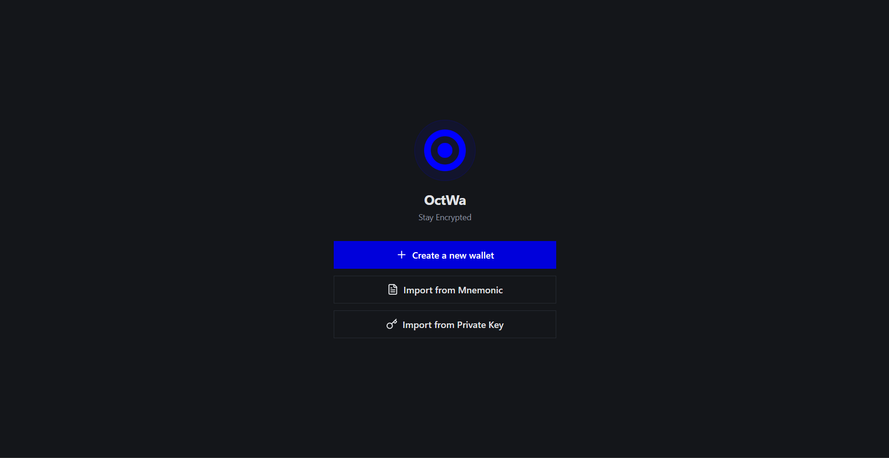
  <br>
  <em>Welcome Screen - Create or Import Wallet</em>
</p>

<p align="center">
  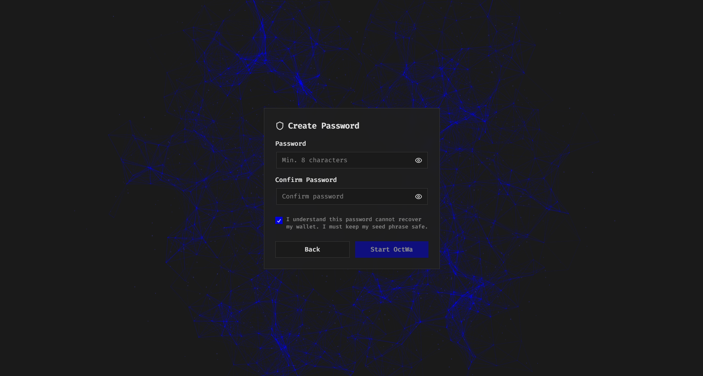
  <br>
  <em>Password Setup - Secure your wallet</em>
</p>

<p align="center">
  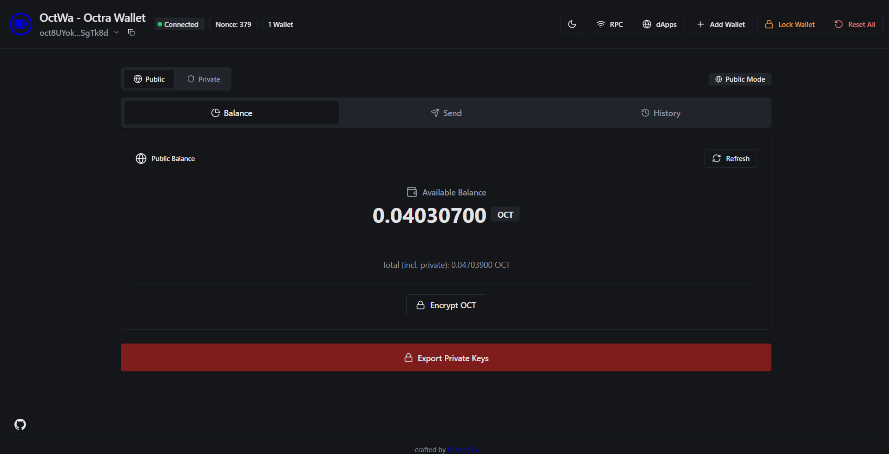
  <br>
  <em>Dashboard - Manage your assets</em>
</p>

<p align="center">
  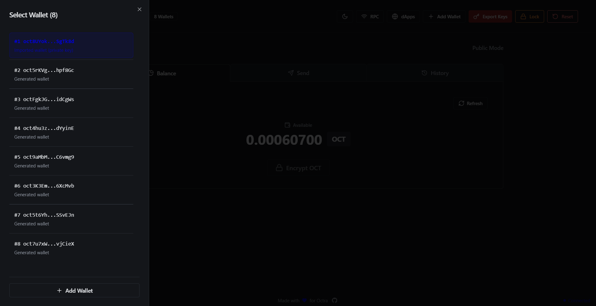
  <br>
  <em>Multi Wallet - Manage multiple wallets</em>
</p>

<p align="center">
  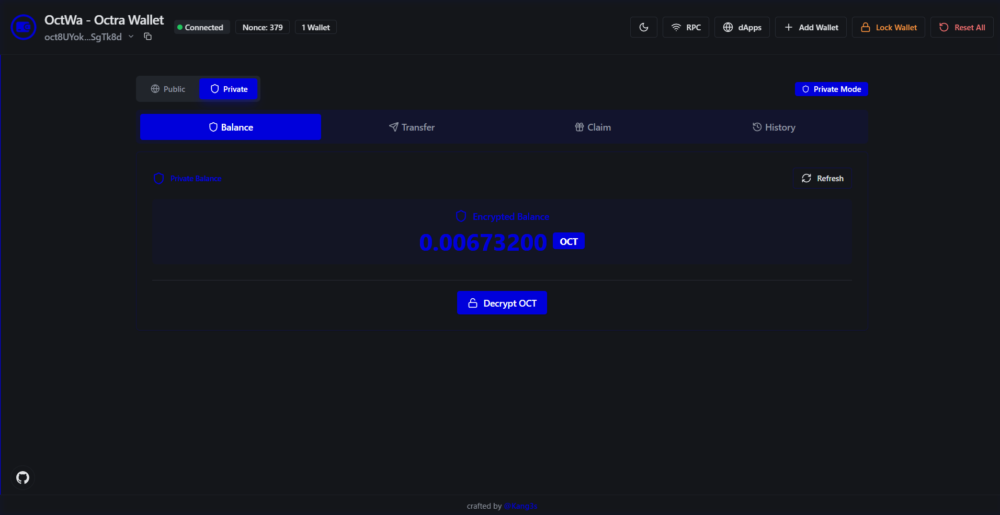
  <br>
  <em>Private Mode - Confidential transactions</em>
</p>

### Popup Mode (Browser Extension)

<p align="center">
  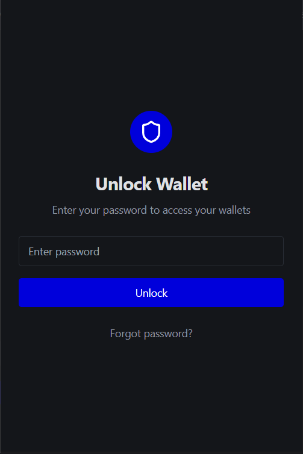
  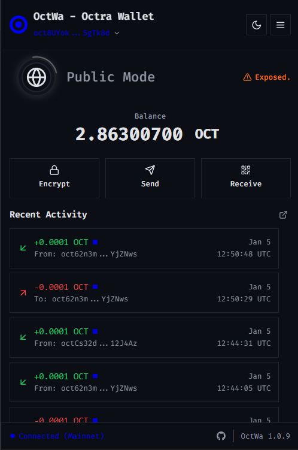
  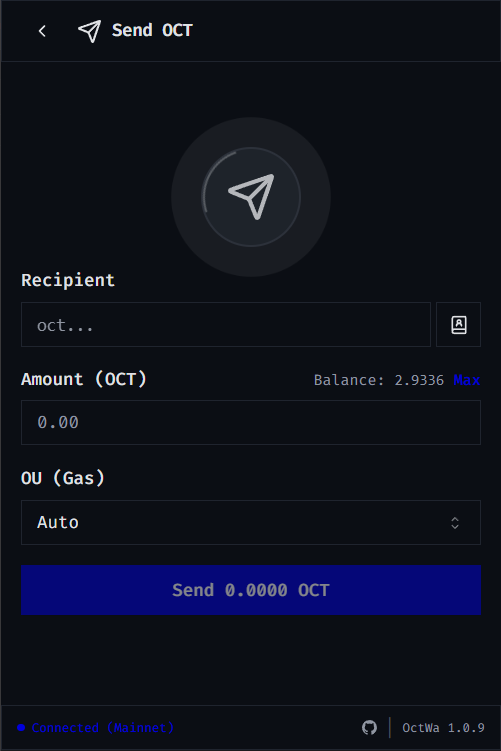
  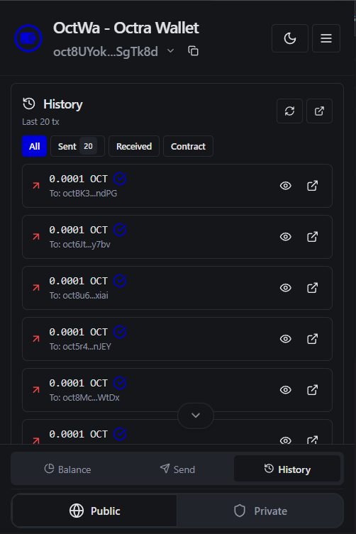
</p>
<p align="center">
  <em>Popup Mode: Locked → Dashboard → Send → History</em>
</p>

<p align="center">
  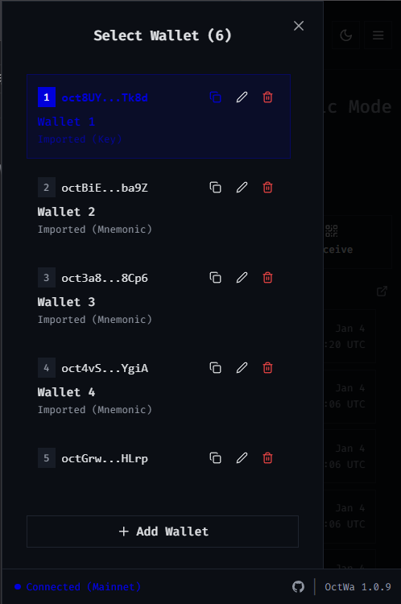
  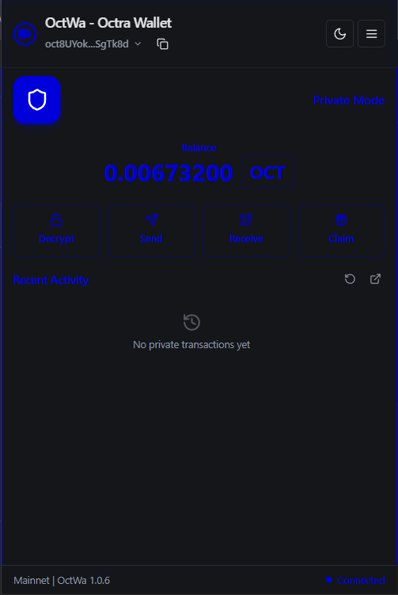
  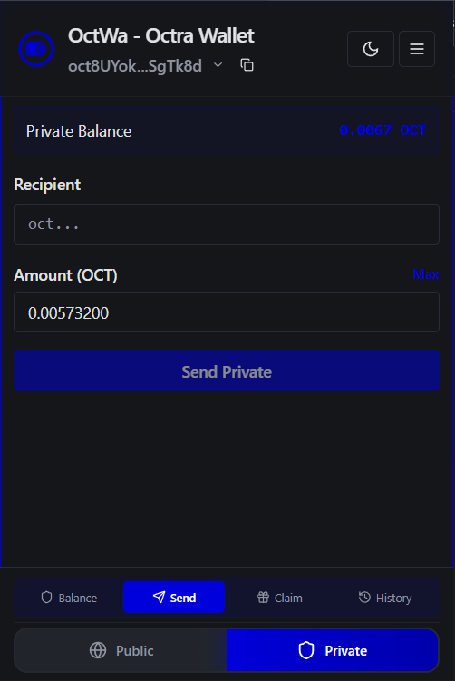
</p>
<p align="center">
  <em>Multi Wallet & Private Mode in Popup</em>
</p>

## Features

### Wallet Management
- **Create New Wallet** - Generate a new wallet with secure mnemonic phrase (BIP39)
- **Import Wallet** - Restore wallet using private key or mnemonic phrase
- **Multiple Wallets** - Manage multiple wallets in a single interface
- **Export Private Keys** - Securely export your private keys with password protection
- **Backup & Restore** - Export encrypted wallet backup for safekeeping

### Security
- **Master Password Protection** - All wallets encrypted with AES-GCM using PBKDF2 derived key
- **Auto-Lock (15 min idle)** - Wallet automatically locks after inactivity
- **Lock on Close** - Wallet locks when browser or extension is closed
- **Brute-Force Protection** - Rate limiting with lockout after failed attempts
- **Password Strength Meter** - Visual indicator helps create strong passwords

### Transactions
- **Send Transaction** - Send OCT tokens to any address
- **Multi-Send** - Send tokens to multiple recipients in one transaction
- **File Multi-Send** - Import recipient list from CSV/TXT file for bulk transfers
- **Transaction History** - View complete transaction history with status tracking

### Privacy Features (Confidential Transactions)
- **Public/Private Mode Toggle** - Switch between public and private operation modes
- **Encrypt Balance** - Convert public balance to encrypted/private balance
- **Decrypt Balance** - Convert encrypted balance back to public balance
- **Private Transfer** - Send confidential transactions with encrypted amounts
- **Claim Transfers** - Claim incoming private transfers

### dApp Integration
- **Web3 Provider** - Inject `window.octra` provider for dApp connectivity
- **Connection Approval** - Approve/reject dApp connection requests
- **Transaction Signing** - Sign transactions requested by dApps
- **Smart Contract Interaction** - Call and invoke smart contract methods
- **Connected dApps Manager** - View and manage connected dApps

### Developer SDK
- **@octwa/sdk** - NPM package for dApp developers to integrate with OctWa
- **TypeScript Support** - Full type definitions for all SDK methods
- **Event System** - Subscribe to wallet events (connect, disconnect, accountChanged)

### User Experience
- **Dark/Light Theme** - Toggle between dark and light themes
- **Responsive Design** - Works on desktop and mobile browsers
- **Popup & Expanded View** - Compact popup or full-page expanded interface
- **RPC Provider Manager** - Configure and switch between RPC endpoints
- **Connection Status** - Real-time RPC connection status indicator

---

## Deployment Guide

This project ships as both a web app and a Chrome/Edge browser extension. The web app is built with Vite + React, and the extension bundles the same UI with additional background/content/provider scripts.

## Overview
- Web app: served as static files from `dist` with a small RPC proxy for production.
- Browser extension: load `dist` as an unpacked extension or zip for store submission.
- Multi-entry build: Vite builds `main` (web), `popup` (extension popup), and `expanded` (extension full-page) entries (`vite.config.ts:16–20`).

## Prerequisites
- Node.js 18+ and npm 9+.
- Chrome or Microsoft Edge for the extension.
- Optional: Nginx (or any reverse proxy) for production RPC proxying.

## Install
```bash
npm install
```

## Development

### Web (local)
- Start dev server:
  ```bash
  npm run dev
  ```
- Opens at `http://localhost:5173/`.
- API calls during development go through the Vite proxy at `/api` and can target different RPC endpoints via the `X-RPC-URL` header set in code (`src/utils/api.ts`).

-### Extension (local)
- Build extension assets into `dist` (cross‑platform):
  ```bash
  npm run build:extension
  ```
  This runs `npm run build` then copies files from `extensionFiles/` into `dist/` via a Node script, so it works on Windows/macOS/Linux:
  - `manifest.json`, `background.js`, `popup.html`, `content.js`, `provider.js`, `octra-sdk.js`, `icons/`.
- Load in Chrome/Edge:
  - Open `chrome://extensions` or `edge://extensions`.
  - Enable `Developer mode`.
  - Click `Load unpacked` and select the `dist` folder.

## Production Build

### Web
- Build optimized assets:
  ```bash
  npm run build:prod
  ```
- Serve `dist/` with any static host (Nginx, Apache, S3+CDN, etc.).
- In production, API calls are made to `/rpc-proxy/...` and require a reverse proxy that forwards requests based on the `X-RPC-Target` header (`src/utils/api.ts`). See Nginx sample below.

### Extension
- Build extension:
  ```bash
  npm run build:extension
  ```
- Verify `dist/` contains:
  - `manifest.json`, `background.js`, `popup.html`, `content.js`, `provider.js`, `octra-sdk.js`, `icons/`.
  - `assets/popup.js`, `assets/expanded.js`, `assets/index.css` from Vite build.
- Zip `dist/` and submit to Chrome Web Store / Edge Add-ons.

## Nginx (web) configuration

Serve static files and provide a dynamic RPC proxy that uses `X-RPC-Target` to route requests to the selected RPC endpoint.

```nginx
server {
    listen 80;
    server_name wallet.example.com;

    root /var/www/octra-wallet/dist;
    index index.html;

    # Serve the SPA
    location / {
        try_files $uri $uri/ /index.html;
    }

    # Extract parts of the target for headers
    map $http_x_rpc_target $rpc_host { ~^https?://([^/]+) $1; }

    # Dynamic RPC proxy
    location /rpc-proxy/ {
        # Require the header
        if ($http_x_rpc_target = "") { return 400; }

        # Resolve arbitrary upstream hosts
        resolver 1.1.1.1 8.8.8.8 valid=300s ipv6=off;

        # Set Host header to upstream host
        proxy_set_header Host $rpc_host;

        # Drop the /rpc-proxy prefix
        rewrite ^/rpc-proxy(.*)$ $1 break;

        # Forward to the URL from header (scheme+host)
        proxy_pass $http_x_rpc_target;

        # TLS SNI for https upstreams
        proxy_ssl_server_name on;

        # Timeouts (tune as needed)
        proxy_connect_timeout 5s;
        proxy_read_timeout 30s;
    }
}
```

- Development proxy: Vite dev proxy for `/api` is configured in `vite.config.ts:33–65` and sets the `Host` header based on `X-RPC-URL`.
- Production proxy: web app sets `X-RPC-Target` and uses `/rpc-proxy` (`src/utils/api.ts`).

## Configuration
- Default RPC: The app initializes a default provider to `https://octra.network`. You can manage providers from the UI (RPC Provider Manager) or by seeding `localStorage` key `rpcProviders`.
- Environment variables: A sample `.env.example` includes `VITE_DEFAULT_RPC_URL`, but current code primarily reads providers from storage and uses the UI to set the active provider.

## Project Structure Notes
- Multi-entry build:
  - `vite.config.ts:16–20` defines inputs for `index.html` (web), `src/popup.tsx` (extension popup), and `src/expanded.tsx` (extension expanded view).
- Extension popup HTML: `extensionFiles/popup.html` loads `assets/popup.js` and adds `#root`.
- Background/content/provider scripts live in `extensionFiles/` and are copied to `dist` during `build:extension`.

## Troubleshooting
- `npm run deploy` references `./deploy.sh`, which is not present; use `npm run build:prod` and your own hosting steps.
- CORS errors (web): ensure the Nginx `/rpc-proxy` is configured; the extension can call RPC endpoints directly due to `host_permissions` in `manifest.json`.
- Extension build is cross‑platform via `scripts/copy-extension-files.mjs`.

---

With the above, you can run locally, build for production, host the web app, and package the extension without further changes.
