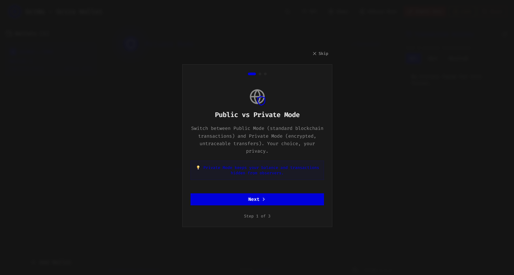
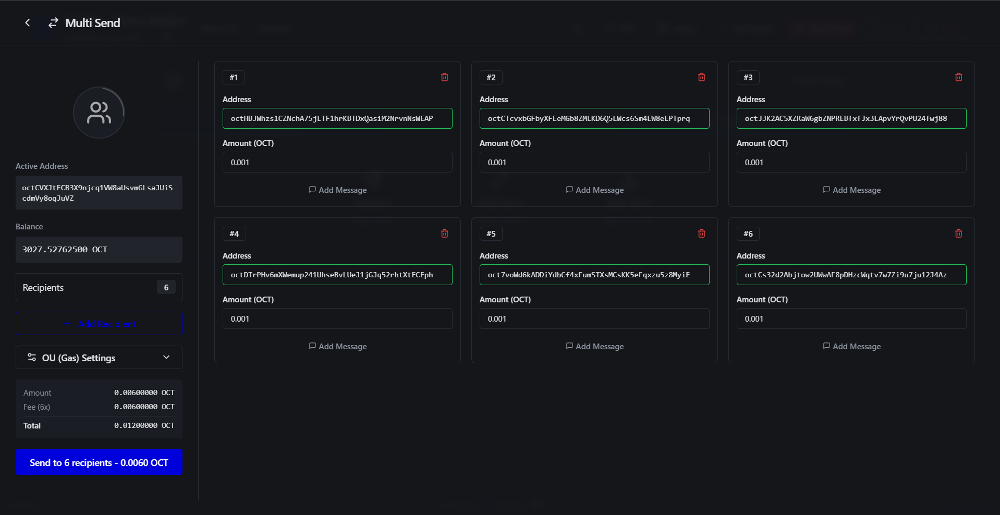
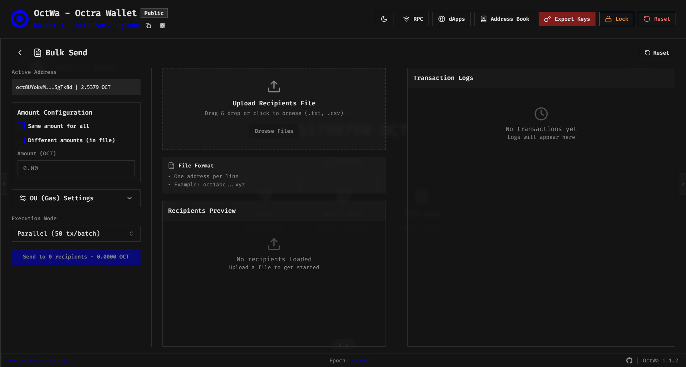
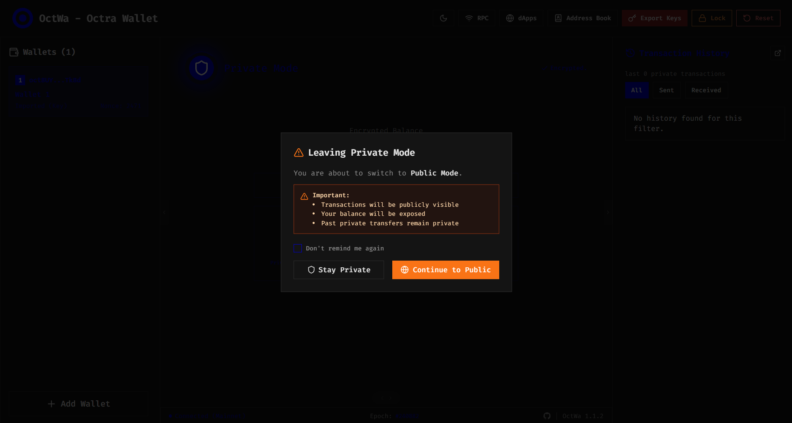
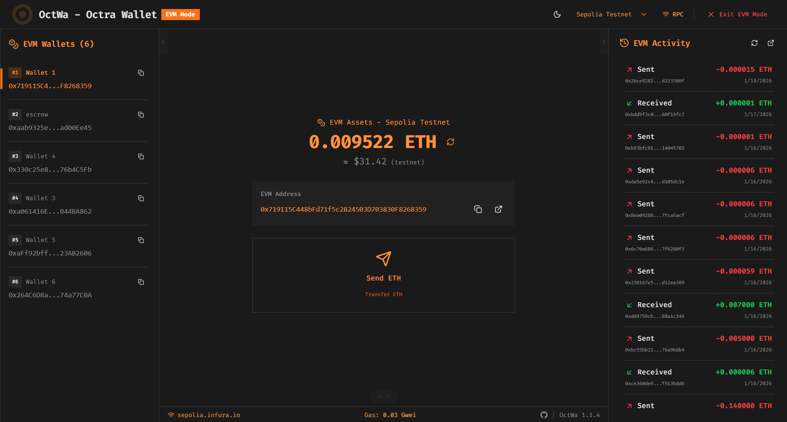
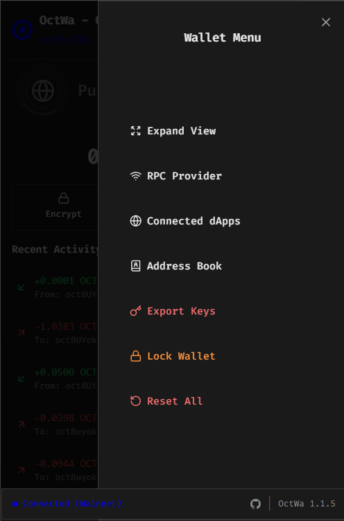

# OCTWA - Octra Wallet

A secure browser-based wallet for the Octra blockchain network. Available as both a web application and Chrome/Edge browser extension.

**Encrypted by Default** — Powered by Octra HFHE

## Project Structure

```
octwa/
├── src/                    # Main wallet application
├── extensionFiles/         # Browser extension files
├── packages/sdk/           # @octwa/sdk - dApp integration SDK
├── landing/                # Landing page
└── scripts/                # Build scripts
```

## SDK

The `@octwa/sdk` package is available on npm for dApp integration:

```bash
npm install @octwa/sdk
```

See [packages/sdk/README.md](packages/sdk/README.md) for documentation.

## Security Features

### Encryption & Key Management
- **PBKDF2 Key Derivation** - 310,000 iterations with 32-byte salt
- **AES-256-GCM Encryption** - All wallet data encrypted with master password
- **Encrypted-Only Storage** - Private keys NEVER stored unencrypted
- **Session Key Isolation** - Unique encryption key per session

### Session Security
- **Auto-Lock Protection** - Automatic locking after 15 minutes
- **Cross-Tab Sync** - Lock state synchronized across views
- **Browser Close Lock** - Auto-locks when browser closes

### Access Control
- **Rate Limiting** - 5 failed attempts triggers 5-minute lockout
- **Password Strength Validation** - Real-time strength indicator
- **Password Re-verification** - Required for sensitive operations

## Features

### Wallet Management
- Create/Import wallets (BIP39 mnemonic)
- Multiple wallet support
- Secure private key export

### Transactions
- Standard send
- Multi-send (multiple recipients)
- Bulk send (CSV import)
- Transaction history

### Privacy (Confidential Transactions)
- Public/Private mode toggle
- Encrypt/Decrypt balance
- Private transfers with FHE

### dApp Integration
- Web3 provider (`window.octra`)
- Connection approval flow
- Transaction signing
- Smart contract interaction

## Quick Start

```bash
# Install dependencies
npm install

# Development
npm run dev

# Build for production
npm run build:prod

# Build browser extension
npm run build:extension
```

## Browser Extension

1. Build: `npm run build:extension`
2. Open `chrome://extensions` or `edge://extensions`
3. Enable Developer mode
4. Load unpacked → select `dist` folder

## Configuration

Default RPC: `https://octra.network`

Manage providers via UI (RPC Provider Manager) or seed `localStorage` key `rpcProviders`.

## Screenshots

### Web Application

<p align="center">
  
  <br><em>Welcome Screen</em>
</p>

<p align="center">
  
  <br><em>Password Setup</em>
</p>

<p align="center">
  
  <br><em>Dashboard</em>
</p>

<p align="center">
  
  <br><em>Onboarding - first</em>
</p>

<p align="center">
  
  <br><em>Onboarding - last</em>
</p>

<p align="center">
  
  <br><em>Multi Wallet Support</em>
</p>

<p align="center">
  
  <br><em>Multi Send</em>
</p>

<p align="center">
  
  <br><em>Bulk Send (CSV Import)</em>
</p>

<p align="center">
  
  <br><em>Privacy Mode Setup</em>
</p>

<p align="center">
  
  <br><em>Private Mode with FHE</em>
</p>

<p align="center">
  
  <br><em>EVM Assets</em>
</p>

### Browser Extension (Popup)

<table>
  <tr>
    <td align="center">
      <br>
      <em>Locked State</em>
    </td>
    <td align="center">
      <br>
      <em>Dashboard</em>
    </td>
  </tr>
  <tr>
    <td align="center">
      <br>
      <em>Multi Wallet</em>
    </td>
    <td align="center">
      <br>
      <em>Wallet Menu</em>
    </td>
  </tr>
  <tr>
    <td align="center">
      <br>
      <em>Public Send</em>
    </td>
    <td align="center">
      <br>
      <em>Private Dashboard</em>
    </td>
  </tr>
  <tr>
    <td align="center" colspan="2">
      <br>
      <em>Private Send</em>
    </td>
  </tr>
</table>

## Video Demo

[](https://www.youtube.com/watch?v=n7hdKntWBzA)

## License

MIT
